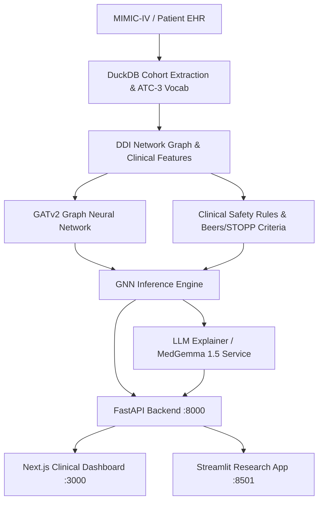

# GeriSafe CDSS: Predictive Drug Safety & Inpatient Fall Risk Prevention

[](https://www.python.org/downloads/)
[](https://fastapi.tiangolo.com)
[](https://nextjs.org/)
[](https://pyg.org/)
[](LICENSE)

A Clinical Decision Support System (CDSS) for predicting medication-related safety risks and inpatient fall events in geriatric polypharmacy cohorts. 

GeriSafe combines **multimodal Graph Neural Networks (GATv2)** for learning drug-drug interaction (DDI) topologies, **deterministic clinical guardrails** (AGS Beers Criteria 2023, STOPP/START v3, FRID classifications), **MedGemma 1.5 LLM reasoning** for mechanistic clinical rationales, and a modern **Next.js Inpatient Ward Dashboard** for real-time clinician workflow integration and CPOE deprescribing.

---

## System Architecture



### Key Modules
- **`src/api/`**: FastAPI production service (`main.py`) providing patient census, real-time telemetry streaming (SSE), what-if deprescribing simulations, FHIR R4 bundle generation, and CPOE order signing audit trail.
- **`frontend/`**: Next.js 16 + React 19 + TailwindCSS clinical dashboard featuring inpatient ward census, risk acuity filtering, GNN interaction graphs, and admission intake modals.
- **`src/models/`**: PyTorch Geometric GATv2 model (`gnn_fall_model.py`), tabular predictor, PyHealth baseline, and inference engine (`gnn_inference.py`).
- **`src/clinical_rules/`**: AGS Beers Criteria (2023), STOPP/START v3, Fall-Risk-Increasing Drugs (FRID), anticholinergic burden, and renal contraindication auditors.
- **`src/explainability/`**: Mechanistic clinical explainer, Captum feature attribution, and MedGemma 1.5 / Ollama Docker pipeline.
- **`app/gnn_app.py`**: Standalone Streamlit interactive clinical explorer.

---

## Prerequisites

Ensure you have the following installed on your system:
- **Python**: Version `3.12` or newer ([Download Python](https://www.python.org/downloads/))
- **Node.js**: Version `18.x` or `20.x`+ with `npm` ([Download Node.js](https://nodejs.org/))
- **Docker & Docker Desktop** *(Optional)*: Required only if running the local GPU-accelerated MedGemma 1.5 / Ollama container. If Docker is omitted, the system seamlessly falls back to rule-based expert clinical reasoning.
- **NVIDIA GPU with CUDA 12.4+** *(Optional)*: Supported for accelerated GNN training/inference and local LLM execution. CPU execution is fully supported out of the box.

---

## Quick Start: How to Run the Project

### 1. Environment Setup

Clone the repository and configure your Python environment:

#### Using `uv` (Fastest, Recommended):
```bash
# Sync dependencies directly from pyproject.toml / uv.lock
uv sync
```

#### Using `venv` & `pip`:
```bash
# Create virtual environment
python -m venv .venv

# Activate environment:
# Windows (PowerShell / CMD)
.venv\Scripts\activate
# Linux / macOS
source .venv/bin/activate

# Install dependencies
pip install -r requirements.txt
```

---

### 2. (Optional) Start the Clinical AI Service (MedGemma / Ollama)

If you wish to run the local MedGemma 1.5 model for LLM clinical rationales:

```powershell
# Windows PowerShell (automated setup with Docker Desktop):
powershell -ExecutionPolicy Bypass -File scripts/start_medgemma_docker.ps1

# Or via standard Docker Compose:
docker compose up -d
```
> **Note**: If Ollama/Docker is not running, the application will automatically fall back to deterministic expert synthesis, so you can still run the entire application without Docker.

---

### 3. Start the FastAPI Backend Server

Run the backend API from the project root:

```bash
# Ensure virtual environment is active
uvicorn src.api.main:app --reload --host 127.0.0.1 --port 8000
```
*(Alternatively, you can run `python src/api/main.py`)*

- **Backend API**: [http://127.0.0.1:8000](http://127.0.0.1:8000)
- **Interactive Swagger Docs**: [http://127.0.0.1:8000/docs](http://127.0.0.1:8000/docs)
- **ReDoc Documentation**: [http://127.0.0.1:8000/redoc](http://127.0.0.1:8000/redoc)

---

### 4. Start the Next.js Frontend Dashboard

Open a separate terminal window and start the clinical UI:

```bash
cd frontend

# Install Node dependencies (first time only)
npm install

# Start development server
npm run dev
```

Open your browser and navigate to:
👉 **[http://localhost:3000](http://localhost:3000)**

#### Inpatient Dashboard Highlights:
- **Ward Census**: Filter patients by acuity tier (Critical, High, Moderate, Low), bed, or search by MRN/Name.
- **Multimodal Risk Breakdown**: View GNN predicted fall probability alongside clinical guardrails (CNS polypharmacy, FRID classes, renal contraindications).
- **Interactive DDI Attention Graph**: Inspect GNN attention weights between co-prescribed medications.
- **What-If Deprescribing Simulator**: Toggle medications on/off to immediately preview projected risk reduction before committing changes.
- **CPOE Deprescribing Order Sign-off**: Electronic order authorization with automated audit logging.
- **Ingest Admission Modal**: Submit custom clinical admission profiles and medication regimens for on-the-fly risk prediction.

---

### 5. (Alternative) Run the Streamlit Research Explorer

If you prefer a lightweight, standalone Python web app for experimenting with GNN weights and patient graphs:

```bash
streamlit run app/gnn_app.py
```
Access the Streamlit interface at **[http://localhost:8501](http://localhost:8501)**.

---

## Verification & Smoke Tests

To verify that all components, models, and explainability engines are working properly:

### 1. Test GNN Inference & What-If Simulation Suite
Validates model weights, edge cases, and deprescribing delta predictions across preset geriatric clinical scenarios:
```bash
python scripts/test_gnn_inference.py
```

### 2. Test LLM Explainer & Guideline Synthesis
Tests the pharmacological rationale engine and guideline citations (AGS Beers 2023, STOPP v3):
```bash
python src/explainability/test_llm_explainer.py
```

### 3. PyHealth Baseline Smoke Test
Runs a 2-epoch RETAIN model training smoke test:
```bash
python scripts/smoke_test.py
```

---

## Data Pipeline & MIMIC-IV Setup

> **Data Privacy Notice**: Raw clinical datasets (e.g., MIMIC-IV, DrugBank) and derived clinical parquets are **not** committed to the repository in compliance with PhysioNet credentialing agreements.

If you are setting up the data pipeline from scratch using MIMIC-IV:

1. Place your credentialed MIMIC-IV hospital module CSVs in:
   - `data/raw/mimic4/hosp/` (or `data/raw/MIMIC-iv v.2.1/hosp/`)
2. Verify that tables load:
   ```bash
   python -m src.data.sanity_check
   ```
3. Extract the geriatric polypharmacy cohort (DuckDB):
   ```bash
   python -m src.data_prep.cohort_selection
   ```
4. Build drug vocabulary and export artifacts:
   ```bash
   python -m src.data.save_artifacts
   ```
5. Train the GNN model:
   ```bash
   python -m src.models.train_gnn
   ```

---

## Key API Endpoints Reference

| Endpoint | Method | Description |
|---|---|---|
| `/api/health` | `GET` | System health check, GNN load state, and CUDA/CPU device info |
| `/api/patients` | `GET` | Retrieves full 48-patient ward census with risk scores and sort options |
| `/api/patient/{id}` | `GET` | Detailed patient record with labs, active meds, and GNN SHAP drivers |
| `/api/ward/kpis` | `GET` | Returns aggregated clinical KPI metrics for Inpatient Ward 4B |
| `/api/ward/distribution` | `GET` | Patient counts partitioned across calibrated risk stratums |
| `/api/fhir/export` | `GET` | Exports patient records as standard HL7 FHIR R4 JSON Bundle |
| `/api/trajectory/{id}` | `GET` | 12-month longitudinal Gantt swimlanes and cascade discovery |
| `/api/drugs/search` | `GET` | Substring search across the 5,034-drug GNN vocabulary |
| `/api/rules` | `GET` | Codified Beers, STOPP, DDInter, and Renal clinical rules |
| `/api/predict-gnn` | `POST` | Live PyG GNN fall risk inference and attention weights |
| `/api/simulate-deprescribing` | `POST` | Computes GNN risk delta after removing targeted drug |
| `/api/admissions/ingest` | `POST` | Ingests new inpatient admission with live risk evaluation |
| `/api/medgemma/pipeline` | `POST` | End-to-end MedGemma 1.5 clinical analysis & recommendations |
| `/api/cpoe/sign` | `POST` | Electronic signature for deprescribing orders with audit logging |
| `/api/audit-log` | `GET` | Clinical governance and deprescribing decision audit trail |
| `/api/telemetry/stream` | `GET` | Real-time Server-Sent Events (SSE) ward telemetry stream |

---

## License

This project is licensed under the MIT License - see the [LICENSE](LICENSE) file for details. Underlying EHR and drug databases remain under their respective data-use agreements.
